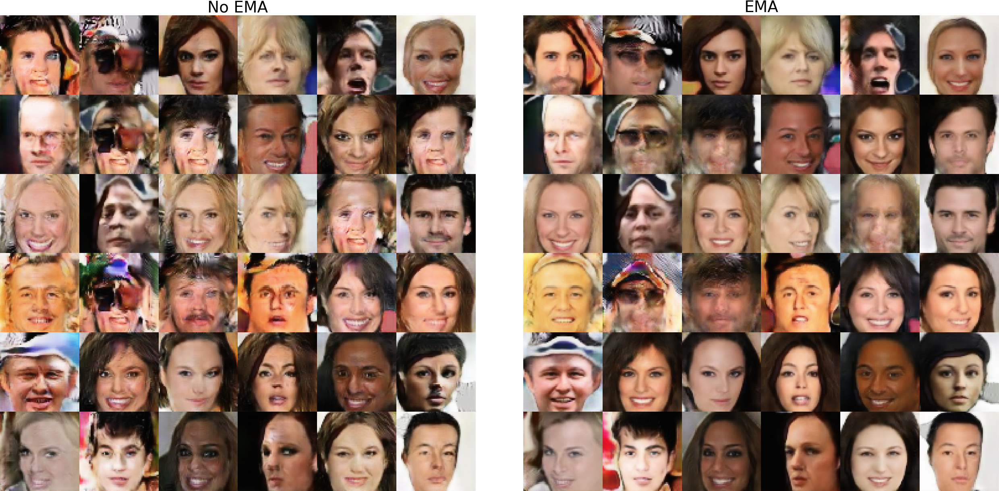

# FaceGen-GAN
Conditional face generation experiments using GAN models on CelebA dataset.

## Architectures
- **Vanilla DCGAN**: a normal DCGAN as described in [DCGAN paper](https://arxiv.org/abs/1511.06434), has training stability issues.
- **Hinge DCGAN with custom layers**: an improved DCGAN with spectral normalization, self-attention, minibatch std and pixelwise normalization, which allows stable training with better visual results than DCGAN.

## EMA Training

   

In order to improve generated image quality, it is also possible to [train a model](train_gan_model_ema.py) using **exponential moving average** (EMA) update, as defined in [The Unusual Effectiveness of Averaging in GAN Training](https://arxiv.org/abs/1806.04498) paper.

The code is based on the update function found [here](https://gist.github.com/alexpod1000/924c4a14abec411ee723b62899c89a79/), which allows updating a second generator model's weights using EMA update using the following equation: 

wt+1 = (1 - b) * ut + (b) * wt (assuming **u** are the weights of a generator trained via gradient methods)
